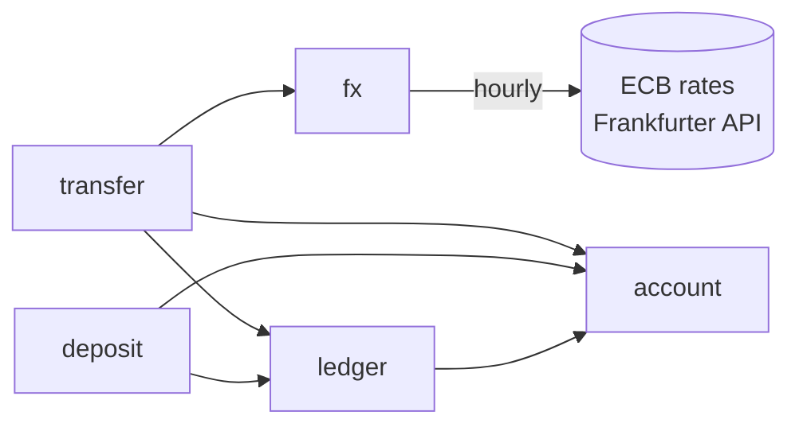

# fx-ledger

[](https://github.com/edyiaeonian/fx-ledger/actions/workflows/ci.yml)

A multi-currency ledger with locked FX quotes and idempotent transfers, in Java and
Spring Boot on PostgreSQL.

- **Money is never created or destroyed.** Every movement is a double-entry journal
  entry whose postings net to zero in each currency, and a property test checks that
  across hundreds of random sequences of deposits, retries and transfers.
- **A retry never moves money twice.** Deposits and transfers take an
  `Idempotency-Key`; the key is claimed by a unique insert, so even simultaneous
  duplicates resolve to one result.
- **Concurrency is tested, not assumed.** Sixteen threads at once cannot overdraw an
  account, spend one quote twice or deadlock. Removing the locks makes those tests fail,
  and one of them found a real deadlock, since fixed.
- **The customer sees the price before paying it.** Quotes use the ECB daily reference
  rate as the mid-market rate, with no markup, show the fee separately, and are locked
  for ten minutes.

Write-up: [A PostgreSQL deadlock hiding in a foreign key check](https://dev.to/edyiaeonian/a-postgresql-deadlock-hiding-in-a-foreign-key-check-55ni)
— how a concurrency test in this project found a deadlock, and why `FOR NO KEY UPDATE`
fixed it.

## Try it

Needs only Docker.

```bash
docker compose up --build
```

Then open **http://localhost:8080/swagger-ui.html**. The endpoints are numbered in the
order to try them. Or from a terminal (with [jq](https://jqlang.org)):

```bash
J='Content-Type: application/json'

# Two customers, an EUR account and a GBP account
ALICE=$(curl -s -X POST localhost:8080/customers -H "$J" -d '{"name":"Alice"}' | jq -r .id)
BOB=$(curl -s -X POST localhost:8080/customers -H "$J" -d '{"name":"Bob"}' | jq -r .id)
EUR=$(curl -s -X POST localhost:8080/customers/$ALICE/accounts -H "$J" -d '{"currency":"EUR"}' | jq -r .id)
GBP=$(curl -s -X POST localhost:8080/customers/$BOB/accounts -H "$J" -d '{"currency":"GBP"}' | jq -r .id)

# Deposit 250 EUR (run it twice: the second answers "Idempotent-Replayed: true")
curl -i -X POST localhost:8080/accounts/$EUR/deposits -H "$J" \
  -H 'Idempotency-Key: deposit-1' -d '{"amount":"250.00","currency":"EUR"}'

# Price 200 EUR in GBP, then carry the quote out
QUOTE=$(curl -s -X POST localhost:8080/quotes -H "$J" \
  -d '{"sourceCurrency":"EUR","targetCurrency":"GBP","sourceAmount":"200.00"}' | tee /dev/stderr | jq -r .id)
curl -X POST localhost:8080/transfers -H "$J" -H 'Idempotency-Key: transfer-1' \
  -d "{\"quoteId\":\"$QUOTE\",\"sourceAccountId\":\"$EUR\",\"targetAccountId\":\"$GBP\"}"

# Every posting, with the running balance
curl localhost:8080/accounts/$EUR/statement
```

Rates are the ECB's daily reference rates (through the
[Frankfurter API](https://frankfurter.dev), no key needed), fetched at startup and hourly.
Running the whole script again creates new customers and accounts, whose keys are new
to them: idempotency keys belong to one account, so `deposit-1` on Bob's account is not
a retry of `deposit-1` on Alice's.

## What a transfer does

Alice sends 100.00 EUR to Bob's GBP account. The fee is 0.5% and the rate 0.85. The quote
says Bob gets 84.57 GBP, and the transfer writes one journal entry:

| Account | Currency | Amount |
|---|---|---|
| Alice | EUR | −100.00 |
| Fee revenue | EUR | +0.50 |
| FX position | EUR | +99.50 |
| FX position | GBP | −84.57 |
| Bob | GBP | +84.57 |

Each currency sums to zero on its own. The FX position accounts are what let it balance
across currencies: they take euros in and pay pounds out. 99.50 × 0.85 = 84.575, and the
amount paid out is rounded **down** while the fee is rounded **up**, so the service never
pays out more than the arithmetic gives. The customer sees both figures in the quote,
before accepting it. An amount the fee would swallow, or one that rounds down to nothing
in the target currency (1 JPY to EUR, say), is refused with a 422 rather than quoted at
zero; the database also rejects a quote whose payout is not positive.

## Architecture

A modular monolith: one Spring Boot application and one PostgreSQL database, split into
modules that call each other only through their services, never each other's tables.



| Module | Owns |
|---|---|
| `account` | Customers, accounts, balances, row locks |
| `ledger` | Journal entries and postings; the only code that moves money |
| `fx` | Reference rates, the quote arithmetic, quotes |
| `deposit` | Simulated incoming money, idempotent |
| `transfer` | Carrying out a quote: the one place that coordinates the others |
| `money` | `Money`, an amount in a currency's minor unit |

Why not microservices: a transfer debits one account and credits another, and in one
database that is one transaction. Split across services it becomes a distributed
transaction (a saga, compensations, reconciliation), which is a large cost for no gain at
this size. The module boundaries are where a split would go.

## How the money stays right

**Amounts are integers.** `Money` holds a `long` count of the currency's minor unit
(cents for EUR, yen for JPY, which has none smaller) and never passes through `double`.
Only multiplying by a rate uses `BigDecimal`, and every such step names its rounding mode;
there is no default to inherit by accident. An input finer than the currency's minor unit
(`"1.005"` EUR) is refused, not rounded, since rounding would hide the caller's error.
Overflow throws instead of wrapping around.

**Entries balance, and the database checks too.** The ledger refuses an entry whose
postings do not net to zero per currency. PostgreSQL independently refuses a negative
customer balance (a `CHECK` constraint) and a posting in a currency other than its
account's (a composite foreign key), so a bug in the application cannot break either.

**Idempotency is a unique insert.** A deposit or transfer first inserts its row with the
client's key under a unique constraint, scoped to the account (the account deposited
into, or transferred from): with no authentication, the account stands in for the client,
and two customers choosing the same key must not collide. A duplicate arriving at the same moment waits for
the first transaction: if that commits, the duplicate returns its result; if it rolls back,
the duplicate proceeds. A request that fails (insufficient funds, an expired quote) rolls
back its claim, so it can be corrected and retried under the same key. A key reused for a
*different* request is a 409, detected by a hash of the request stored with the key.

**Locks are taken in one order.** A transfer locks the quote, then the accounts, always in
ascending id order, so two transfers can wait for each other but never deadlock. The quote
lock means one quote can be carried out once; a unique constraint on `transfers.quote_id`
holds even if that check were skipped.

**The right lock, not the strongest one.** Accounts are locked `FOR NO KEY UPDATE`, not
`FOR UPDATE`. Inserting a deposit row checks its foreign key to the account by taking a
shared `KEY SHARE` lock on it, and `FOR UPDATE` conflicts with that: two deposits into one
account each held the shared lock and waited for the other's, a deadlock. A concurrency
test found it. `FOR NO KEY UPDATE` does not conflict with `KEY SHARE` but still conflicts
with itself, so balance updates stay one at a time.

**Every wait for a lock is capped.** `lock_timeout` is set on every connection, not in the
methods that lock, because locks are taken in places that are easy to overlook, such as
that foreign key check. A request that times out gets a 503 and can be retried with the
same key.

**An outage elsewhere does not stop quotes.** Rates are fetched hourly and stored; quotes
read the database, never the network. If the rate API goes down, quotes continue on the
stored rates until they are more than five days old, then stop with a 503 rather than
price from stale data. Five, because the ECB publishes nothing at weekends or on TARGET
holidays, and the longest gap is Easter: Thursday's rates are the latest until Tuesday
afternoon. The first version allowed four days, which would have stopped every quote on
the morning of every Easter Tuesday; a test now pins Easter 2027.

**A daily reference rate is not a live one.** The ECB fixes its reference rates once a day,
around 14:10 CET, and publishes them for information. This project uses them as its
mid-market rate because they are free and authoritative. A real service would price from a
live feed: a quote priced from a snapshot hours old leaves the FX position exposed to
whatever the market did since, and that risk is the service's, not the customer's.

## What the tests prove

Every test runs in CI on every push, against a real PostgreSQL (Testcontainers). A second
CI job builds the Docker image, starts the whole service with `docker compose` and drives it
over HTTP.

| Test | Shows |
|---|---|
| Ledger invariants | After any operation: every entry nets to zero per currency; each cached balance equals its postings and its latest running balance; no customer account is negative |
| Property test (jqwik) | 200 random sequences of accounts, deposits, idempotent retries, moves and quoted cross-currency transfers (overdrafts included) match an in-memory model at every step. A failure is shrunk to the shortest sequence that reproduces it |
| Concurrency | 16 threads at once: opposing transfers do not deadlock, racing withdrawals cannot overdraw, one idempotency key deposits once, one quote is carried out once |
| Rate source | Against WireMock: timeouts, dropped connections, errors, malformed JSON, and a rate with more digits than a `double` holds, read exactly |
| Time | With a controllable clock: quotes expire after ten minutes; rates survive the Easter gap and stop quoting once older than five days |

Each safeguard was also removed on purpose, to check that a test fails without it:

| Removed | Result |
|---|---|
| Locking accounts in id order | PostgreSQL reports a deadlock |
| The row lock on accounts | All 16 of 16 racing withdrawals succeed against a balance that covers 10, and concurrent updates are lost |
| One cent added to what a transfer pays out | The property test fails and shrinks the case to six operations. The ledger still balanced; only the model caught it |

## Design decisions

| Decision | Why | Instead of |
|---|---|---|
| Integer minor units | No floating-point error, no half cents | `double`; `BigDecimal` everywhere |
| Double-entry, append-only postings | Every cent has a source and a destination, auditable | Updating balances in place |
| Cached balance plus invariant tests | Reading a balance is one row, and the cache is proven to match | Summing every posting on read |
| Reference rate plus a visible fee | The customer knows the rate and the fee separately | A markup hidden in the rate |
| Fee rounded up, payout rounded down | Never pay out more than the arithmetic; both shown in advance | Rounding half-up both |
| Quotes lock the rate for ten minutes | What the customer accepts is what happens | Pricing at transfer time |
| Idempotency key per account, plus request hash | Retries are safe; a reused key for a different request is caught; customers do not collide | Trusting clients not to resend; one key space for everyone |
| Failed requests not remembered | A request that failed for a fixable reason can be retried | Caching failures too |
| Row locks in id order, `FOR NO KEY UPDATE` | No overdrafts, no deadlocks, including with foreign key checks | Optimistic locking with retries |
| Rates fetched on a schedule | The rate API being down does not fail quotes; staleness has a limit | Calling the API per quote |
| Plain SQL through `JdbcClient` | Lock clauses and lock order are exactly as written | An ORM generating the queries |
| Real PostgreSQL in tests | Locking behaves as in production | An in-memory database |

## What changed during implementation

The design came first; building and testing it changed these parts of it.

| Area | Designed | Built | Why |
|---|---|---|---|
| Account row lock | `FOR UPDATE` | `FOR NO KEY UPDATE` | A deposit's foreign key check takes `KEY SHARE` on the account, which `FOR UPDATE` conflicts with: two deposits into one account deadlocked. A concurrency test found it; the bug had been there since deposits were added |
| Lock wait limit | Set inside the ledger | Set on every connection | The foreign key check waits for its lock before the ledger runs, so the limit never applied there. A test that held a lock showed requests waiting until it was released |
| Oldest usable rates | 4 days | 5 days | Every Easter, Thursday's rates are the latest until Tuesday afternoon |
| Idempotency key scope | Whole table | Per account | Two customers choosing the same key collided |
| "Current" rates | The latest stored | The latest dated today or earlier | Rates dated in the future must not be used |
| Transfer status | `PENDING` then `COMPLETED` | `COMPLETED` only | A failure rolls back the whole transaction, so no other transaction could ever see `PENDING` |

## Deliberately out of scope

- **Authentication.** Customer ids are in the path; the subject is ledger correctness.
- **Paying out to banks, webhooks, asynchronous states.** Transfers complete within the
  ledger, synchronously.
- **"Recipient gets exactly X" quotes.** Only "send exactly X".
- **A user interface.** Swagger UI is enough to try the API.

## Development

Needs JDK 25 and Docker.

```bash
./gradlew build     # compiles and runs every test; tests start PostgreSQL themselves
./gradlew bootRun   # runs the service; starts the database from compose.dev.yaml
```

Java 25, Spring Boot 4.1.1, Gradle 9.7.1, PostgreSQL 18, Flyway, springdoc-openapi 3.1.0,
JUnit 5, jqwik 1.10.1, Testcontainers, WireMock 3.13.2.

The [design document](docs/specs/2026-09-25-fx-ledger-design.md) and
[implementation plan](docs/plans/2026-09-25-fx-ledger-implementation-plan.md) are written
in Traditional Chinese; the identifiers and SQL in them are language-independent.

## Licence

MIT. See [LICENSE](LICENSE).
